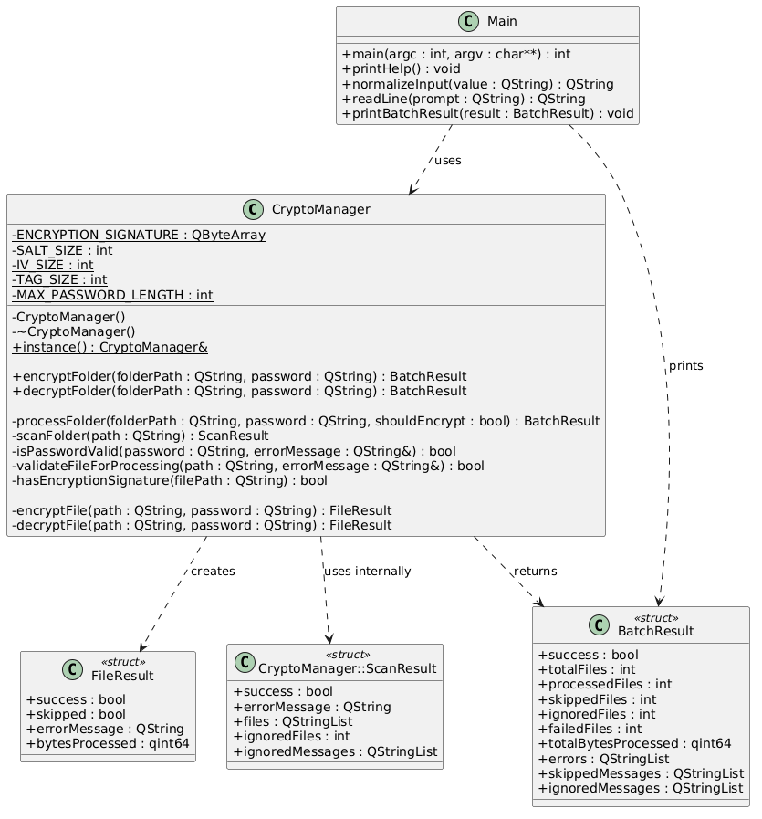
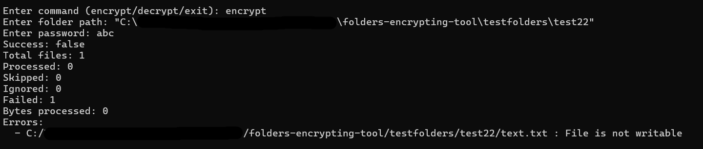
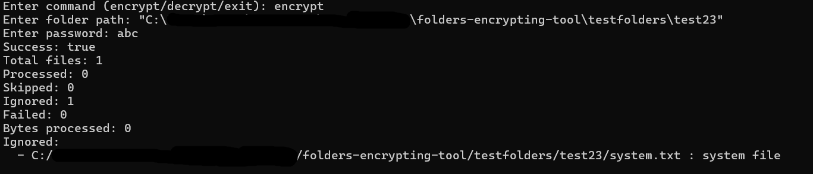
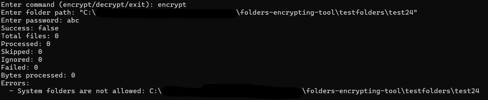
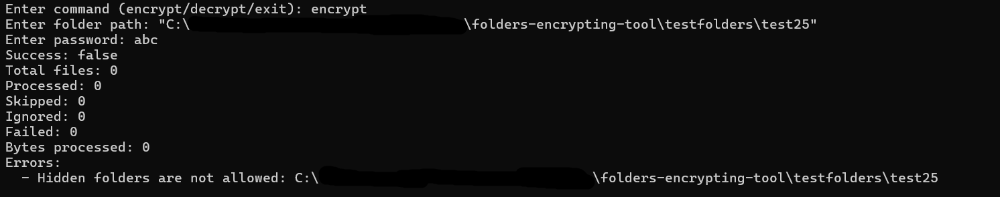
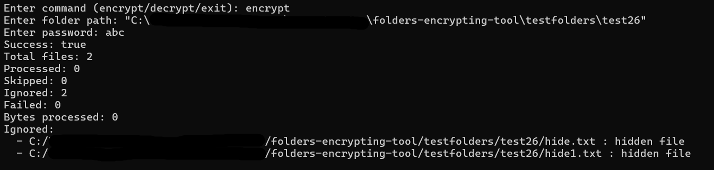
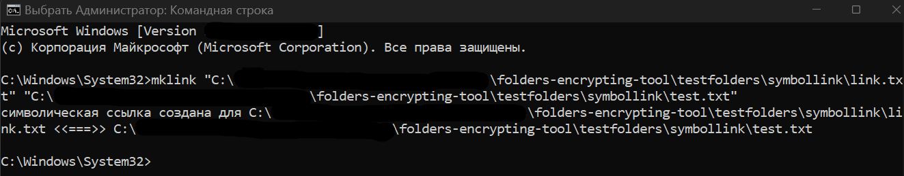
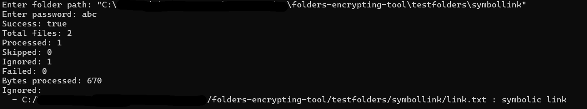

# Folder Encrypting Tool

## Постановка задачи
Разработать консольную утилиту на языке C++ для шифрования и дешифрования файлов в указанной директории и её подпапках.

Программа выполняет рекурсивный обход заданной пользователем папки и в зависимости от выбранного режима выполняет шифрование или дешифрование всех найденных файлов. В качестве основной библиотеки для реализации шифрования можно использовать библиотеку Crypto++ Library либо алгоритм AES-256. Основной класс, обеспечивающий шифрование (encryption) и дешифрование (decryption), реализован с использованием паттерна Singleton, что гарантирует наличие единственного экземпляра и централизованное управление процессом обработки данных.
## Архитектура

### Общая идея решения

Программа построена по принципу централизованного управления.
Для реализации шифрования используется библиотека Crypto++ и алгоритм AES-256 в режиме GCM.
Класс CryptoManager является основным компонентом системы и отвечает за:

- координацию процесса обработки;
- обход директорий;
- шифрование и дешифрование файлов;
- проверку входных данных;
- формирование итоговой статистики.

Алгоритм работы:

- Пользователь вводит команду (encrypt, decrypt, exit).
- Пользователь вводит путь к директории.
- Проверяется корректность пути.
- Выполняется рекурсивный обход директории.
- Для каждого файла из списка результата обхода папки выполняется операция шифрования или дешифрования.
- Формируется и выводится статистика выполнения.

---

### Основные компоненты системы
#### CryptoManager

Центральный управляющий класс.

Функции:
- обработка папки (processFolder);
- шифрование файлов (encryptFile);
- дешифрование файлов (decryptFile);
- рекурсивный обход директории (scanFolder);
- проверка корректности пароля;
- генерация криптографических параметров (salt, IV, ключ);
- агрегация результатов (BatchResult).

Реализован с использованием паттерна Singleton, что обеспечивает единственный экземпляр класса в программе.

---
#### Структуры данных
#### FileResult

Результат обработки одного файла:
- success — успешность операции;
- skipped — файл пропущен;
- errorMessage — сообщение об ошибке;
- bytesProcessed — количество обработанных байт.
---
#### BatchResult

Результат обработки директории:

- success — итоговый статус операции;
- totalFiles — общее количество найденных файлов с учётом проигнорированных;
- processedFiles — количество успешно обработанных файлов;
- skippedFiles — количество пропущенных файлов;
- ignoredFiles — количество файлов, исключённых из обработки на этапе обхода;
- failedFiles — количество файлов, обработка которых завершилась ошибкой;
- totalBytesProcessed — общий объём обработанных данных;
- errors — список ошибок;
- skippedMessages — список причин пропуска файлов;
- ignoredMessages — список файлов, проигнорированных при обходе.
---

#### ScanResult
Результат обхода директории:
- success — успешность обхода;
- errorMessage — сообщение об ошибке при невозможности обхода;
- files — список файлов, допущенных к обработке;
- ignoredFiles — количество файлов, исключённых из обработки;
- ignoredMessages — список причин игнорирования файлов.
---
## Используемое ПО 
QT v5.15.2 
C++ v17 
Бибилиотека Crypto++(в данном проекте библиотека расположена в дочерней директории(third_party) папки проекта, при желании в файле проекта можно указать пути к библиотеке. Это будет полезно, если библиотека уже установлена на вашей машине) 

## Процесс шифрования и дешифрования
### Шифрование

Алгоритм шифрования включает следующие этапы:

1. Проверка файла (существование, доступ, ограничения).
2. Генерация случайной соли (16 байт).
3. Генерация случайного IV (12 байт).
4. Вывод ключа из пароля с помощью PBKDF2 (HMAC-SHA256, 100000 итераций).
5. Шифрование данных с использованием AES-256-GCM.
6. Формирование аутентификационного тега (16 байт).
7. Запись результата в файл: [signature][salt][IV][ciphertext][authentication tag]
8. Атомарная замена файла через QSaveFile.

Соль (salt) — случайные данные, используемые при выводе ключа для защиты от атак по словарю. 
Аутентификационный тег — значение, позволяющее проверить целостность и подлинность данных при дешифровании. 

---

### Дешифрование

Процесс дешифрования выполняет обратные действия:

1. Проверка корректности файла и наличия сигнатуры зашифрованного файла.
2. Чтение служебных данных:
   - salt;
   - IV;
   - зашифрованных данных.
3. Повторное вычисление криптографического ключа из введённого пароля и сохранённой соли.
4. Выполнение дешифрования с использованием AES-256-GCM.
5. Проверка аутентификационного тега (выполняется в процессе дешифрования методами используемой библиотеки):
   - если тег корректен — данные считаются неизменёнными;
   - если тег некорректен — выбрасывается исключение(обрабатывается программой).
6. Атомарная запись расшифрованных данных в файл через QSaveFile.

Если пароль неверен или данные были изменены, дешифрование завершается ошибкой, и файл не изменяется.

## Инструкции для пользователя
После запуска программа работает в интерактивном режиме.

Доступные команды: 
- encrypt — шифрование файла или папки 
- decrypt — дешифрование файла или папки 
- exit — выход из программы 

**Пример использования** 
Enter command (encrypt/decrypt/exit): encrypt 
Enter folder path: C:\test 
Enter password: 1234 

## Ограничения
- Обрабатываются только файлы внутри директории (одиночные файлы не поддерживаются).
- Скрытые файлы и папки не обрабатываются (не шифруются и не дешифруются).
- Системные файлы и каталоги не обрабатываются: на Windows проверяется наличие системного атрибута файла, на Unix-подобных системах исключаются стандартные системные директории (например, /proc, /sys, /dev).
- Символьные ссылки игнорируются.
- Максимальная длина пароля — 64 символа.
- При потере пароля восстановление данных невозможно.
- Файл полностью считывается в память при обработке, поэтому на данный момент предполагается работа с файлами небольшого размера.

## Тест-кейсы

### Тест-кейс 1. Ввод пустой команды
Входные данные: 
Нажать Enter, не вводя команду. 

Вывод: 
Выводится сообщение о том, что ввод не должен быть пустым. Запрашивается повторный ввод команды. 

---

### Тест-кейс 2. Ввод недопустимой команды
Входные данные: 
Ввести строку, отличную от `encrypt`, `decrypt`, `exit`. 

Вывод: 
Выводится сообщение о неизвестной команде "Unknown command. Please enter encrypt, decrypt or exit". Запрашивается повторный ввод команды. 

---

### Тест-кейс 3. Выход из программы на этапе ввода команды
Входные данные: 
Ввести `exit`. 

Вывод: 
Программа завершает работу без кода ошибки. 

---

### Тест-кейс 4. Выход из программы на этапе ввода пути
Предусловие: 
Ввести `encrypt` или `decrypt`. 

Входные данные: 
Ввести `exit` вместо пути к директории. 

Вывод: 
Программа завершает работу без кода ошибки. 

---

### Тест-кейс 5. Выход из программы на этапе ввода пароля
Предусловие: 
Ввести `encrypt` или `decrypt`. 
Ввести путь к существующей директории. 

Входные данные: 
Ввести `exit` вместо пароля. 

Вывод: 
Программа завершает работу без кода ошибки. 

---

### Тест-кейс 6. Ввод несуществующего пути
Входные данные: 
Ввести `encrypt`. 
Ввести путь к несуществующей директории. 
"C:\...\folders-encrypting-tool\testfolders\test454546" 
Ввести пароль "abc". 
Вывод: 
Выводится сообщение о том, что путь не существует. Операция не выполняется. Возврат к выбору режима. 
Errors:
  - Folder does not exist: C:\...\folders-encrypting-tool\testfolders\test454546

---

### Тест-кейс 7. Ввод пути к одиночному файлу
Входные данные: 
Ввести `encrypt`. 
Ввести путь к существующему файлу "C:\...\folders-encrypting-tool\testfolders\test7.txt". 
Ввести пароль "abc". 
Вывод: 
Выводится сообщение о том, что указанный путь не является директорией. Операция не выполняется. 
Errors:
  - Path is not a folder: C:\...\folders-encrypting-tool\testfolders\test7.txt
---

### Тест-кейс 8. Ввод пустого пути
Входные данные: 
Ввести `encrypt`. 
ввести строку из пробелов на этапе ввода пути. 

Вывод: 
Выводится сообщение о том, что ввод не должен быть пустым. Операция не выполняется. Возврат к выбору режима.  

---

### Тест-кейс 9. Ввод пустого пароля
Предусловие: 
Существует директория с файлами. 

Входные данные: 
Ввести `encrypt`. 
Ввести путь к директории "C:\...\folders-encrypting-tool\testfolders\test9". 
ввести строку из пробелов на этапе ввода пароля. 

Вывод: 
Выводится сообщение об ошибке, что пароль не должен быть пустым. Операция не выполняется. Возврат к выбору режима. 

---

### Тест-кейс 10. Превышение максимальной длины пароля
Предусловие: 
Существует директория с файлами. 

Входные данные: 
Ввести `encrypt`. 
Ввести путь к директории "C:\...\folders-encrypting-tool\testfolders\test10". 
Ввести пароль длиной более 64 символов. "p016GTfPQ53JDJ26ptQApK7vOsKutKtoU7bNqKBuVcgms9LNiEa55wRMKS4K91T5fgfgfyyeSSFFG" 

Вывод: 
Выводится сообщение о превышении максимальной длины пароля. Операция не выполняется. Возврат к выбору режима. 

---

### Тест-кейс 11. Ввод пароля максимальной длины
Предусловие: 
Существует директория с файлами. 

Входные данные: 
Ввести `encrypt`. 
Ввести путь к директории "C:\...\folders-encrypting-tool\testfolders\test11". 
Ввести пароль длиной 64 символа. "p016GTfPQ53JDJ26ptQApK7vOsKutKtoU7bNqKBuVcgms9LNiEa55wRMKS4K91T5" 

Вывод: 
Операция выполняется успешно. Выводится статистика обработки. 

---

### Тест-кейс 12. Шифрование директории с файлами
Предусловие: 
Директория содержит файлы. 

Входные данные: 
Ввести `encrypt`. 
Ввести путь к директории "C:\...\folders-encrypting-tool\testfolders\test12". 
Ввести пароль "abc". 

Вывод: 
Файлы шифруются. Выводится статистика обработки. 

---

### Тест-кейс 13. Дешифрование директории
Предусловие: 
Директория ранее была зашифрована утилитой с паролем "abc". 

Входные данные: 
Ввести `decrypt`. 
Ввести путь к директории "C:\...\folders-encrypting-tool\testfolders\test13". 
Ввести пароль "abc". 

Вывод: 
Файлы успешно расшифровываются. Выводится статистика. 

---

### Тест-кейс 14. Дешифрование с неверным паролем
Предусловие: 
Директория ранее Была зашифрована утилитой с паролем "abc". 

Входные данные: 
Ввести `decrypt`. 
Ввести путь к директории "C:\...\folders-encrypting-tool\testfolders\test14". 
Ввести неверный пароль "cba". 

Вывод: 
Дешифрование завершается ошибкой. Файлы не изменяются. Ошибки отображаются в статистике. 
Errors:
  - C:/.../folders-encrypting-tool/testfolders/test14/tabl.png : Invalid password or corrupted encrypted file
  - C:/.../folders-encrypting-tool/testfolders/test14/test1.txt : Invalid password or corrupted encrypted file

---

### Тест-кейс 15. Повторное шифрование директории
Предусловие: 
Директория ранее Была зашифрована утилитой с паролем "abc". 

Входные данные: 
Ввести `encrypt`. 
Ввести путь к директории "C:\...\folders-encrypting-tool\testfolders\test15". 
Ввести пароль "abc". 

Вывод: 
Файлы пропускаются. Статистика отражает пропущенные файлы. 
Skipped:
  - C:/.../folders-encrypting-tool/testfolders/test15/tabl.png : File is already encrypted
  - C:/.../folders-encrypting-tool/testfolders/test15/test1.txt : File is already encrypted

---

### Тест-кейс 16. Дешифрование незашифрованных файлов
Предусловие: 
Директория содержит обычные файлы. 

Входные данные: 
Ввести `decrypt`. 
Ввести путь к директории "C:\...\folders-encrypting-tool\testfolders\test16". 
Ввести пароль "abc". 

Вывод: 
Файлы пропускаются. Выводится статистика. 
Skipped:
  - C:/.../folders-encrypting-tool/testfolders/test16/tabl.png : File is not encrypted
  - C:/.../folders-encrypting-tool/testfolders/test16/test1.txt : File is not encrypted

---

### Тест-кейс 17. Шифрование пустой директории
Предусловие: 
Директория пустая. 

Входные данные: 
Ввести `encrypt`. 
Ввести путь к директории "C:\...\folders-encrypting-tool\testfolders\empty". 
Ввести пароль "abc". 

Вывод: 
Операция завершается. Статистика содержит нулевые значения. 

---

### Тест-кейс 18. Шифрование директории с вложенными папками
Предусловие: 
Есть вложенные директории с файлами. 

Входные данные: 
Ввести `encrypt`. 
Ввести путь к директории "C:\...\folders-encrypting-tool\testfolders\test18". 
Ввести пароль "abc". 

Вывод: 
Файлы во вложенных директориях обрабатываются. Выводится статистика. 

---

### Тест-кейс 19. Дешифрование директории с вложенными папками
Предусловие: 
Директория ранее Была зашифрована утилитой с паролем "abc". 

Входные данные: 
Ввести `decrypt`. 
Ввести путь к директории "C:\...\folders-encrypting-tool\testfolders\test19". 
Ввести пароль "abc". 

Вывод: 
Файлы успешно расшифровываются. Иерархия файлов сохраняется. 

---

### Тест-кейс 20. Шифрование директории с новыми файлами
Предусловие: 
Часть файлов уже зашифрована, добавлен новый файл. 

Входные данные: 
Ввести `encrypt`. 
Ввести путь к директории "C:\...\folders-encrypting-tool\testfolders\test20". 
Ввести пароль "cba". 

Вывод: 
Новый файл шифруется, старые пропускаются. Выводится статистика. 

---

### Тест-кейс 21. Дешифрование файлов с разными паролями
Предусловие: 
Файлы зашифрованы разными паролями.  
TEST20 - "cba"
Остальные два файла - "abc"
Входные данные: 
Ввести `decrypt`. 
Ввести путь к директории "C:\...\folders-encrypting-tool\testfolders\test21". 
Ввести пароль "cba". 

Вывод: 
TEST20 расшифровывается, остальные файлы остаются зашифрованными. Ошибки отображаются. 

---

### Тест-кейс 22. Файл только для чтения
Предусловие: 
В директории есть файл только для чтения. 

Входные данные: 
Ввести `encrypt`. 
Ввести путь к директории "C:\...\folders-encrypting-tool\testfolders\test22". 
Ввести пароль "abc". 

Вывод: 
Файл не изменяется. Выводится ошибка записи. 

---

### Тест-кейс 23. Системный файл
Предусловие: 
В директории есть системный файл. 

Входные данные: 
Ввести `encrypt`. 
Ввести путь к директории "C:\...\folders-encrypting-tool\testfolders\test23". 
Ввести пароль "abc". 

Вывод: 
Системный файл отображается в разделе `Ignored`. 

---

### Тест-кейс 24. Системная директория
Предусловие: 
Директория имеет атрибут "системный". 

Входные данные: 
Ввести `encrypt`. 
Ввести путь к директории  "C:\...\folders-encrypting-tool\testfolders\test24". 
Ввести пароль "abc". 

Вывод: 
Операция не выполняется. Выводится ошибка `System folders are not allowed`. 

---
### Тест-кейс 25. Скрытая директория
Предусловие: 
Существует скрытая директория. 

Входные данные: 
Ввести `encrypt`. 
Ввести путь к директории "C:\...\folders-encrypting-tool\testfolders\test25". 
Ввести пароль "abc". 
Вывод: 
Операция не выполняется. Выводится ошибка `Hidden folders are not allowed`. 

---

### Тест-кейс 26. Скрытые файлы
Предусловие: 
В директории есть скрытые файлы. 

Входные данные: 
Ввести `encrypt`. 
Ввести путь к директории "C:\...\folders-encrypting-tool\testfolders\test26". 
Ввести пароль "abc". 

Вывод: 
Скрытые файлы отображаются в разделе `Ignored` 

---

### Тест-кейс 27. Символическая ссылка
Предусловие: 
В директории есть символическая ссылка. 

Входные данные: 
Ввести `encrypt`. 
Ввести путь к директории "C:\...\folders-encrypting-tool\testfolders\symbollink". 
Ввести пароль "abc". 

Вывод: 
Символическая ссылка игнорируется. Обычные файлы обрабатываются. 

---

### Тест-кейс 28. Ввод пути к архивному файлу

Входные данные: 
Ввести `encrypt`. 
Ввести путь к файлу с расширением `.zip`  "C:\...\folders-encrypting-tool\testfolders\archive.zip". 
Ввести пароль "abc". 
Вывод: 
Сообщение об ошибке: `Path is not a folder`. Операция не выполняется. 
