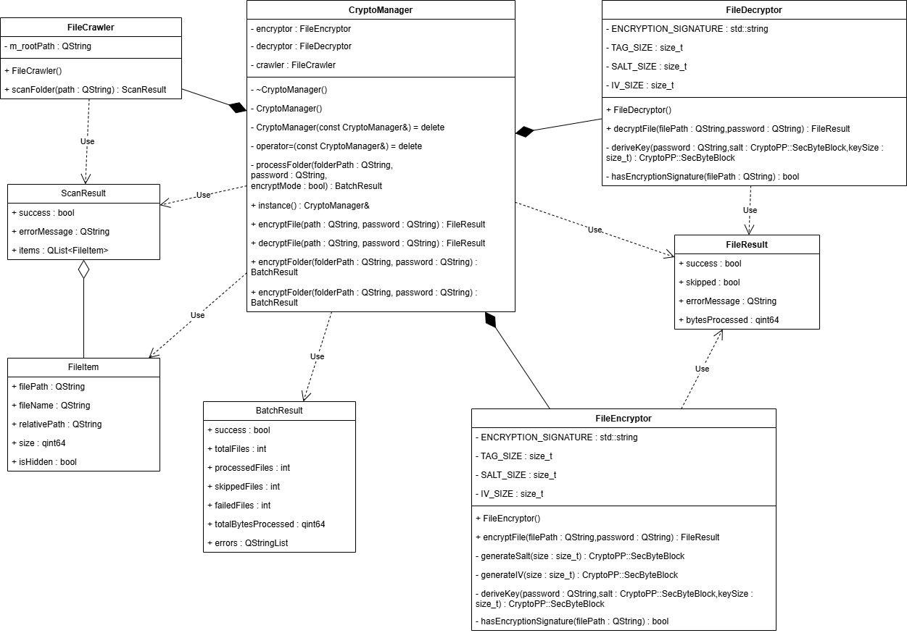

# Folder Encrypting Tool

---
## Постановка задачи
Требуется реализовать консольную утилиту на языке C++  для шифрования и дешифрования файлов в указанной папке, её подпапках. Также возможно шифрование одиночного файла при указании пользователем пути к файлу. Программа выполняет рекурсивный обход введенной пользователем директории,  по запросу пользователя выполняет либо шифрование с использованием AES-256 GCM, либо расшифрование. 
## Архитектура

## Используемое ПО 
QT v5.15.2
C++ v17
Бибилиотека Crypto++(в данном проекте библиотека расположена в дочерней директории(third_party) папки проекта, при желании в файле проекта можно указать пути к библиотеке. Это будет полезно, если библиотека уже установлена на вашей машине)

## Функционал
Программа поддерживает два режима работы.
### Режим шифирования
### Режим дешифрования

## Инструкции для пользователя

## Тест-кейсы
Системные тест-кейсы консольной утилиты
### Тест-кейс 1. Запуск программы и вывод списка доступных команд
Входные данные: 
Запуск программы без выполнения операций шифрования и дешифрования. 
Ожидаемая реакция: 
В консоль выводится информация о назначении программы и список доступных команд: 
-	encrypt  
-	decrypt  
-	exit  
Фактическая реакция: 

### Тест-кейс 2. Ввод пустой команды
Входные данные: 
Пользователь нажимает Enter, не вводя команду. 
Ожидаемая реакция: 
Программа не должна переходить к выполнению операций. Должно быть выведено сообщение о том, что ввод не должен быть пустым. 
Фактическая реакция: 

### Тест-кейс 3. Запуск программы с недопустимым режимом работы 
Входные данные: 
Запуск программы с режимом, отличным от encrypt,decrypt,exit. 
Ожидаемая реакция: 
Программа должна сообщить о неверном вводе режима работы, вывести доступные,а также не выполнять операций с файлами. 
Фактическая реакция: 

### Тест-кейс 4. Выход из программы до перехода к шифрованию/дешифрованию 
Входные данные: 
При первом запросе ввода от пользователя передается “exit”. 
Ожидаемая реакция: 
Программа завершает работу без ошибок. 
Фактическая реакция: 

### Тест-кейс 5. Выход из программы на этапе ввода пути к файлу 
Входные данные: 
При запросе от пользователя ввода пути к файлу/папке передается “exit”. 
Ожидаемая реакция: 
Программа завершает работу без ошибок. 
Фактическая реакция: 

### Тест-кейс 6. Выход из программы на этапе ввода пароля
Входные данные: 
При запросе от пользователя пароля для шифрования/дешифрования передается “exit”. 
Ожидаемая реакция: 
Программа завершает работу без ошибок. 
Фактическая реакция: 

### Тест-кейс 7. Передача нескольких режимов работы за одну передачу 
Входные данные: 
При первом запросе ввода от пользователя передается “encrypt decrypt exit”. 
Ожидаемая реакция: 
Программа должна сообщить о неверной команде и предложить повторить ввод, используя один из режимов: encrypt, decrypt и exit,а также не выполнять операций с файлами. 
Фактическая реакция: 

### Тест-кейс 8. Шифрование существующего файла
Входные данные: 
-	команда: encrypt  
-	путь к существующему обычному файлу  
-	непустой пароль  
Ожидаемая реакция: 
Программа должна сообщить об успешном выполнении операции. Содержимое файла должно измениться и стать нечитаемым.(Это значит, что ранее распознаваемый человеком текст должен стать нечитаемым, не несущим никакой смысловой нагрузки. Либо программа, работающая с каким-то форматом данных должна вывести ошибку о неверном формате. ) 
Фактическая реакция: 

### Тест-кейс 9. Дешифрование ранее зашифрованного файла
Входные данные: 
-	команда: decrypt  
-	путь к ранее зашифрованному файлу  
-	корректный пароль(это значит пароль, который был использован ранее для шифрования тех же файлов)  
Ожидаемая реакция: 
Программа должна сообщить об успешном дешифровании. Содержимое файла должно совпасть с исходным и стать доступным пользователю. 
Фактическая реакция: 

### Тест-кейс 10. Попытка шифрования несуществующего файла
Входные данные: 
-	команда: encrypt  
-	путь к несуществующему файлу  
-	корректный пароль  
Ожидаемая реакция: 
Программа должна вывести сообщение об ошибке, что файл не существует, шифрование не должно выполниться. 
Фактическая реакция: 

### Тест-кейс 11. Попытка дешифрования несуществующего файла
Входные данные: 
-	команда: decrypt  
-	путь к несуществующему файлу  
-	непустой пароль  
Ожидаемая реакция: 
Программа должна вывести сообщение об ошибке, что файл не существует, расшифрование не должно выполниться. 
Фактическая реакция: 

### Тест-кейс 12. Попытка дешифрования незашифрованного файла
Входные данные: 
-	команда: decrypt  
-	путь к обычному незашифрованному файлу  
-	непустой пароль  
Ожидаемая реакция: 
Программа должна сообщить, что файл не является зашифрованным, и не изменять его содержимое. 
Фактическая реакция: 

### Тест-кейс 13. Повторное шифрование уже зашифрованного файла
Входные данные: 
-	команда: encrypt  
-	путь к уже зашифрованному нашей утилитой файлу  
-	корректный пароль  
Ожидаемая реакция: 
Программа должна сообщить, что файл уже зашифрован, и пропустить его без изменений. 
Фактическая реакция: 

### Тест-кейс 14. Дешифрование файла с неверным паролем
Входные данные: 
-	команда: decrypt  
-	путь к зашифрованному файлу  
-	неверный пароль  
Ожидаемая реакция: 
Программа должна вывести сообщение об ошибке дешифрования, что пароль неверен. Файл не должен быть восстановлен в исходное состояние. 
Фактическая реакция: 

### Тест-кейс 15. Шифрование пустого файла
Входные данные: 
-	команда: encrypt  
-	путь к пустому файлу  
-	непустой пароль  
Ожидаемая реакция: 
Программа должна корректно обработать пустой файл и завершить операцию без аварийного завершения. 
Фактическая реакция: 

### Тест-кейс 16. Дешифрование пустого ранее зашифрованного файла
Входные данные: 
-	команда: decrypt  
-	путь к ранее зашифрованному пустому файлу  
-	корректный пароль  
Ожидаемая реакция: 
Программа должна успешно завершить операцию. После дешифрования файл должен остаться пустым. 
Фактическая реакция: 

### Тест-кейс 17. Шифрование существующей папки с файлами
Входные данные: 
-	команда: encrypt  
-	путь к папке, содержащей файлы  
-	корректный пароль  
Ожидаемая реакция: 
Программа должна обработать все доступные файлы в папке, вывести статистику по общему числу файлов, количеству обработанных файлов и объёму обработанных данных. 
Фактическая реакция: 

### Тест-кейс 18. Дешифрование ранее зашифрованной папки
Входные данные: 
-	команда: decrypt  
-	путь к папке с ранее зашифрованными файлами  
-	корректный пароль  
Ожидаемая реакция: 
Программа должна успешно расшифровать файлы и вывести итоговую статистику обработки. 
Фактическая реакция: 

### Тест-кейс 19. Шифрование пустой папки
Входные данные: 
-	команда: encrypt  
-	путь к пустой папке  
-	корректный пароль  
Ожидаемая реакция: 
Программа должна завершить работу корректно и вывести, что файлов для обработки нет. 
Фактическая реакция: 

### Тест-кейс 20. Дешифрование пустой папки
Входные данные: 
-	команда: decrypt  
-	путь к пустой папке  
-	корректный пароль  
Ожидаемая реакция: 
Программа должна завершить работу корректно и вывести нулевую статистику обработки. 
Фактическая реакция: 

### Тест-кейс 21. Шифрование папки с вложенными каталогами
Входные данные: 
-	команда: encrypt  
-	путь к папке, содержащей вложенные подпапки и файлы  
-	корректный пароль  
Ожидаемая реакция: 
Программа должна рекурсивно обработать все файлы во вложенных каталогах и вывести корректную статистику. 
Фактическая реакция: 

### Тест-кейс 22. Дешифрование папки с вложенными каталогами
Входные данные: 
-	команда: decrypt  
-	путь к ранее зашифрованной папке с вложенными каталогами  
-	корректный пароль  
Ожидаемая реакция: 
Программа должна рекурсивно расшифровать все файлы и восстановить их содержимое. 
Фактическая реакция: 

### Тест-кейс 23. Повторное шифрование уже зашифрованной папки
Входные данные: 
-	команда: encrypt  
-	путь к папке, все файлы в которой уже зашифрованы  
-	корректный пароль  
Ожидаемая реакция: 
Программа должна пропустить уже зашифрованные файлы и вывести статистику, отражающую количество пропущенных файлов. 
Фактическая реакция: 

### Тест-кейс 24. Попытка дешифрования папки с обычными незашифрованными файлами
Входные данные: 
-	команда: decrypt  
-	путь к папке с обычными файлами  
-	корректный пароль  
Ожидаемая реакция: 
Программа должна пропустить файлы как незашифрованные и вывести соответствующую статистику. 
Фактическая реакция: 

### Тест-кейс 25. Повторное шифрование папки после добавления нового файла и смены пароля
Входные данные: 
-  Зашифрованная папка с файлами под первым паролем  
-  Новый добавленный в папку файл  
-  Повторный запуск команды encrypt с другим паролем  
Ожидаемая реакция: 
Ранее зашифрованные файлы должны быть пропущены, новый файл должен быть зашифрован. В консоли должна отразиться смешанная статистика: часть файлов пропущена, часть обработана. 
Фактическая реакция: 

### Тест-кейс 26. Дешифрование папки с файлами, зашифрованными разными паролями
Входные данные: 
-  папка, где часть файлов зашифрована одним паролем, а часть другим  
-  команда decrypt  
-  только один из этих паролей  
Ожидаемая реакция: 
Часть файлов должна быть успешно дешифрована, часть должна завершиться ошибкой. В консоли должна быть выведена смешанная статистика: обработанные файлы и ошибки. 
Фактическая реакция: 

### Тест-кейс 27. Ввод пути в кавычках
Входные данные: 
-  команда encrypt или decrypt  
-  путь, введённый вместе с кавычками  
-  корректный пароль  
Ожидаемая реакция: 
Если интерфейс не выполняет очистку строки от кавычек, программа должна вывести сообщение об ошибке из-за некорректного пути. 
Фактическая реакция: 

### Тест-кейс 28. Ввод пустого пути
Входные данные: 
- команда encrypt или decrypt  
- устой путь  
- корректный пароль  
Ожидаемая реакция: 
Программа должна отклонить ввод и вывести сообщение об ошибке либо не допустить переход к операции. 
Фактическая реакция: 

### Тест-кейс 29. Ввод пустого пароля
Входные данные: 
-	команда encrypt или decrypt  
-	корректный путь  
- пустой пароль  
Ожидаемая реакция: 
Программа должна сообщить об ошибке и не выполнять операцию. 
Фактическая реакция: 

### Тест-кейс 30. Попытка зашифровать файл, доступный только для чтения
Входные данные: 
-	команда: encrypt  
-	путь к файлу с атрибутом только для чтения 
-	корректный пароль 
Ожидаемая реакция: 
Программа должна вывести сообщение, что указанный файл недоступен для записи. Файл останется в исходном состоянии. 
Фактическая реакция: 

