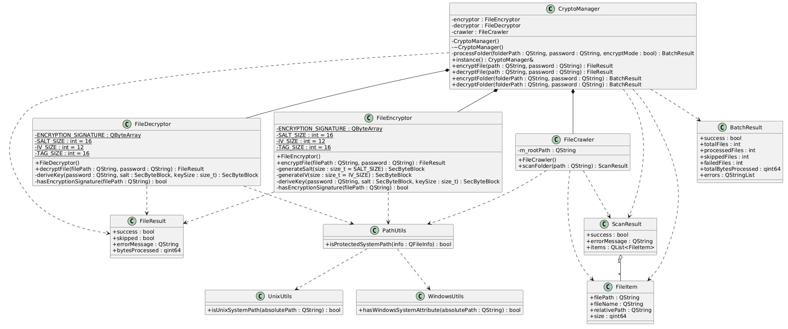
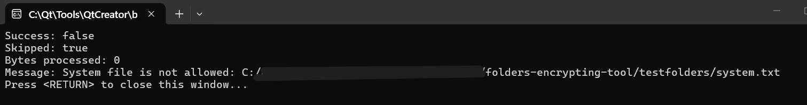

# Folder Encrypting Tool

---
## Постановка задачи
Требуется реализовать консольную утилиту на языке C++  для шифрования и дешифрования файлов в указанной папке, её подпапках. Также возможно шифрование одиночного файла при указании пользователем пути к файлу. Программа выполняет рекурсивный обход введенной пользователем директории,  по запросу пользователя выполняет либо шифрование с использованием AES-256 GCM, либо расшифрование. 
## Архитектура

### Общая идея решения

Программа реализует консольную утилиту для шифрования и дешифрования файлов и директорий.  
Решение основано на разделении ответственности между компонентами.

Центральным компонентом является `CryptoManager`, который управляет процессом обработки и координирует взаимодействие между модулями.

Алгоритм работы:
1. Пользователь вводит команду (encrypt/decrypt) и путь.
2. Определяется тип объекта (файл или директория).
3. При работе с директорией выполняется рекурсивный обход.
4. Для каждого файла выполняется операция шифрования или дешифрования.
5. Формируется итоговая статистика выполнения.

---

### Основные компоненты системы

#### CryptoManager
Центральный управляющий компонент.

Функции:
- обработка команд пользователя;
- выполнение шифрования и дешифрования файлов;
- обработка директорий;
- агрегация результатов (`BatchResult`);
- валидация пароля;
- генерация salt, IV и ключа.

Реализован с использованием паттерна Singleton, что обеспечивает единственный экземпляр класса в программе.

---

#### FileCrawler
Компонент для рекурсивного обхода директорий.

Функции:
- проверка корректности пути;
- обход файловой системы;
- пропуск:
  - скрытых файлов;
  - системных файлов;
  - символьных ссылок;
- формирование списка файлов (`FileItem`).

---

#### FileItem
Структура, описывающая файл:
- полный путь;
- имя;
- относительный путь;
- размер.

---

#### ScanResult
Результат сканирования директории:
- статус операции;
- сообщение об ошибке;
- список найденных файлов.

---

#### FileResult
Результат обработки одного файла:
- успешность операции;
- признак пропуска;
- сообщение об ошибке;
- количество обработанных байт.

---

#### BatchResult
Результат обработки директории:
- общее количество файлов;
- количество обработанных;
- количество пропущенных;
- количество ошибок;
- общий объём обработанных данных;
- список ошибок.

---
## Используемое ПО 
QT v5.15.2 
C++ v17 
Бибилиотека Crypto++(в данном проекте библиотека расположена в дочерней директории(third_party) папки проекта, при желании в файле проекта можно указать пути к библиотеке. Это будет полезно, если библиотека уже установлена на вашей машине) 

## Процесс шифрования и дешифрования
### Шифрование

Алгоритм шифрования включает следующие этапы:

1. Проверка корректности входного файла (существование, доступ, отсутствие системных ограничений).
2. Генерация случайной соли (salt) размером 16 байт.
3. Генерация случайного вектора инициализации (IV) размером 12 байт.
4. Вывод криптографического ключа из пользовательского пароля с использованием алгоритма PBKDF2 (100000 итераций, HMAC-SHA256).
5. Шифрование данных с использованием алгоритма AES-256 в режиме GCM.
6. Формирование аутентификационного тега (16 байт), обеспечивающего контроль целостности.
7. Запись результата в файл в следующем формате:
   - сигнатура зашифрованного файла;
   - salt;
   - IV;
   - зашифрованные данные
   - authentication tag
8. Атомарная замена исходного файла с использованием `QSaveFile`. 
Аутентификационный тег (authentication tag) — это криптографическое значение фиксированной длины, вычисляемое в процессе шифрования на основе секретного ключа, вектора инициализации (IV) и зашифрованных данных, которое используется для проверки целостности и подлинности данных при дешифровании. 
Сигнатура используется для определения того, что файл уже зашифрован данной утилитой. 
Структура зашифрованного файла: 
[signature][salt][IV][ciphertext + tag] 
---

### Дешифрование

Процесс дешифрования выполняет обратные действия:

1. Проверка корректности файла и наличия сигнатуры зашифрованного файла.
2. Чтение служебных данных:
   - salt;
   - IV;
   - зашифрованных данных.
3. Повторное вычисление криптографического ключа из введённого пароля и сохранённой соли.
4. Выполнение дешифрования с использованием AES-256-GCM.
5. Проверка аутентификационного тега:
   - если тег корректен — данные считаются неизменёнными;
   - если тег некорректен — выбрасывается ошибка.
6. Атомарная запись расшифрованных данных в файл.

Если пароль неверен или данные были изменены, дешифрование завершается ошибкой, и файл не изменяется.
## Инструкции для пользователя
После запуска программа работает в интерактивном режиме.

Доступные команды: 
- encrypt — шифрование файла или папки 
- decrypt — дешифрование файла или папки 
- exit — выход из программы 

**Пример использования** 
Enter command (encrypt/decrypt/exit): encrypt 
Enter file or folder path: C:\test\file.txt 
Enter password: 1234 

## Ограничения
Скрытые файлы и папки не обрабатываются 
Символьные ссылки игнорируются 
Системные файлы и каталоги не обрабатываются 
Максимальная длина пароля — 64 символа 
При потере пароля восстановление данных невозможно 

## Тест-кейсы
### Тест-кейс 1. Ввод пустой команды
Входные данные: 
Нажать Enter, не вводя команду. 
Вывод: 
Программа не должна переходить к выполнению операций. Должно быть выведено сообщение о том, что ввод не должен быть пустым. 

### Тест-кейс 2. Запуск программы с недопустимым режимом работы
Входные данные: 
Ввести непустую строку, отличную от encrypt, decrypt, exit. 
Вывод: 
Сообщение о неизвестной команде. Запрос повторного ввода. Операции не выполняются. 

### Тест-кейс 3. Выход из программы до перехода к шифрованию/дешифрованию
Входные данные: 
Ввести "exit". 
Вывод: 
Программа завершает работу без кода ошибки. 

### Тест-кейс 4. Выход из программы на этапе ввода пути к файлу
Предусловие: 
Ввести "encrypt" или "decrypt". 
Входные данные: 
Ввести "exit". 
Вывод: 
Программа завершает работу без ошибок. 

### Тест-кейс 5. Выход из программы на этапе ввода пароля
Предусловие: 
Ввести "encrypt" или "decrypt". 
Ввести путь к существующему файлу. 
Входные данные: 
Ввести "exit". 
Вывод: 
Программа завершает работу без ошибок. 

### Тест-кейс 6. Шифрование существующего незашифрованного файла
Входные данные: 
Ввести "encrypt" 
Ввести "...\testfolders\filefor67.txt". 
Ввести "abc" 
Вывод: 
Содержимое файла должно измениться и стать нечитаемым. 

### Тест-кейс 7. Дешифрование ранее зашифрованного файла
Предусловие: 
Файл ранее был зашифрован данной утилитой с использованием пароля "abc". 
Входные данные: 
Ввести "decrypt" 
Ввести "...\testfolders\filefor67.txt". 
Ввести "abc" 
Вывод: 
Содержимое файла стало исходным. 

### Тест-кейс 8. Попытка шифрования несуществующего файла
Входные данные: 
Ввести "encrypt" 
Ввести "...\testfolders\notexist.txt". 
Вывод: 
Сообщение об ошибке, что файл не существует. Операция не выполняется. 

### Тест-кейс 9. Попытка дешифрования несуществующего файла
Входные данные: 
Ввести "decrypt" 
Ввести "...\testfolders\notexist.txt". 
Вывод: 
Сообщение об ошибке, что файл не существует. Операция не выполняется. 

### Тест-кейс 10. Попытка дешифрования незашифрованного файла
Входные данные: 
Ввести "decrypt" 
Ввести "...\testfolders\test10.txt". 
Ввести "abc" 
Вывод: 
Сообщение о том, что файл не является зашифрованным. Файл не изменяется. 

### Тест-кейс 11. Повторное шифрование уже зашифрованного файла
Предусловие: 
Файл ранее был зашифрован данной утилитой с использованием пароля "abc". 
Входные данные: 
Ввести "encrypt" 
Ввести "...\testfolders\filefor11.txt". 
Ввести "abc" 
Вывод: 
Сообщение о том, что файл уже зашифрован. Файл пропускается. 

### Тест-кейс 12. Дешифрование файла с неверным паролем
Предусловие: 
Файл ранее был зашифрован данной утилитой с использованием пароля "abc". 
Входные данные: 
Ввести "encrypt" 
Ввести "...\testfolders\filefor12.txt". 
Ввести "cba" 
Вывод: 
Сообщение об ошибке дешифрования. Файл не восстанавливается. 

### Тест-кейс 13. Шифрование пустого файла
Входные данные: 
Ввести "encrypt" 
Ввести "...\testfolders\empty.txt". 
Ввести "abc" 
Вывод: 
Операция завершается корректно без ошибок. 

### Тест-кейс 14. Дешифрование пустого файла
Предусловие: 
Файл ранее был зашифрован данной утилитой с использованием пароля "abc". 
Входные данные: 
Ввести "decrypt" 
Ввести "...\testfolders\empty.txt". 
Ввести "abc" 
Вывод: 
Файл становится пустым после дешифрования. 

### Тест-кейс 15. Шифрование папки с файлами
Входные данные: 
Ввести "encrypt" 
Ввести "...\testfolders\test15". 
Ввести "abc" 
Вывод: 
Выводится статистика обработки файлов (общее количество, обработанные, пропущенные, ошибки). 

### Тест-кейс 16. Дешифрование папки с файлами
Предусловие: 
Папка ранее была зашифрована данной утилитой с использованием пароля "abc". 
Входные данные: 
Ввести "decrypt" 
Ввести "...\testfolders\test15". 
Ввести "abc" 
Вывод: 
Выводится статистика обработки файлов (общее количество, обработанные, пропущенные, ошибки). 

### Тест-кейс 17. Шифрование пустой папки
Входные данные: 
Ввести "encrypt" 
Ввести "...\testfolders\empty". 
Ввести "abc" 
Вывод: 
Выводится статистика с нулевыми значениями. 

### Тест-кейс 18. Дешифрование пустой папки
Предусловие: 
Папка ранее была зашифрована данной утилитой с использованием пароля "abc". 
Входные данные: 
Ввести "decrypt" 
Ввести "...\testfolders\empty". 
Ввести "abc" 
Вывод: 
Выводится нулевая статистика обработки. 

### Тест-кейс 19. Шифрование папки с вложенными каталогами
Входные данные: 
Ввести "encrypt" 
Ввести "...\testfolders\test19". 
Ввести "abc" 
Вывод: 
Все файлы во вложенных каталогах обрабатываются. Выводится статистика. 

### Тест-кейс 20. Дешифрование папки с вложенными каталогами
Предусловие: 
Папка ранее была зашифрована данной утилитой с использованием пароля "abc". 
Входные данные: 
Ввести "decrypt" 
Ввести "...\testfolders\test19". 
Ввести "abc" 
Вывод: 
Файлы успешно расшифровываются. Выводится статистика. 

### Тест-кейс 21. Повторное шифрование папки
Предусловие: 
Папка ранее была зашифрована данной утилитой с использованием пароля "abc". 
Входные данные: 
Ввести "encrypt" 
Ввести "...\testfolders\test21". 
Ввести "abc" 
Вывод: 
Файлы пропускаются. Статистика отражает пропущенные файлы. 

### Тест-кейс 22. Дешифрование папки с незашифрованными файлами
Входные данные: 
Ввести "decrypt" 
Ввести "...\testfolders\test22". 
Ввести "abc" 
Вывод: 
Файлы пропускаются. Выводится соответствующая статистика. 

### Тест-кейс 23. Повторное шифрование с новым файлом
Предусловие: 
Папка ранее была зашифрована данной утилитой с использованием пароля "abc". 
Входные данные: 
Добавить в папку "...\testfolders\test23" файл "test23.txt"
Запустить утилиту
Ввести "encrypt" 
Ввести "...\testfolders\test23". 
Ввести "abc1" 
Вывод: 
Уже зашифрованные файлы пропускаются, новый файл шифруется. 

### Тест-кейс 24. Дешифрование файлов с разными паролями
Предусловие: 
Файлы зашифрованы разными паролями. 
Входные данные: 
Ввести "decrypt" 
Ввести "...\testfolders\test23". 
Ввести "abc1" 
Вывод: 
Часть файлов расшифровывается(при правильном пароле), для другой части файлов выводится сообщение о неверном пароле. 

### Тест-кейс 25. Ввод пустого пути
Входные данные: 
Ввести "encrypt" 
Ввести " ". 
Вывод: 
Сообщение о том, что ввод не должен быть пустым. Повторный ввод. 

### Тест-кейс 26. Ввод пустого пароля
Входные данные: 
Ввести "encrypt" 
Ввести "...\testfolders\filefor26.txt". 
Ввести "" 
Вывод: 
Сообщение об ошибке, что пароль пустой. Операция не выполняется. 

### Тест-кейс 27. Превышение длины пароля
Входные данные: 
Ввести "encrypt" 
Ввести "...\testfolders\filefor27.txt". 
Ввести "pdxnehxudaywxipigwsnhbgwebjucpgezxqwbvvdtectmyifwrljkhmaqevnapttbuzwwduqthzbddqunkpppizdukjluskerbsg" 
Вывод: 
Сообщение о том, что пароль не может быть длинее 64 символов. Операция не выполняется. 

### Тест-кейс 28. Максимальная длина пароля
Входные данные: 
Ввести "encrypt" 
Ввести "...\testfolders\filefor28.txt". 
Ввести "JO7rVkXRU8nTEvtHQmTDxARGe4QNCY8GAMWGADbxvcYarGjfmKTotq2bVawB9ZWm" 
Вывод: 
Операция выполняется успешно. 

### Тест-кейс 29. Попытка шифрования файла только для чтения
Входные данные: 
Ввести "encrypt" 
Ввести "...\testfolders\no_access\text.txt". 
Ввести "abc" 
Вывод: 
Сообщение об ошибке записи. Файл не изменяется. 

### Тест-кейс 30. Попытка шифрования системных файлов
Входные данные: 
Ввести "encrypt" 
Ввести "...\testfolders\system.txt". 
Ввести "abc" 
Вывод: 
Сообщение об ошибке. Нельзя работать с системными файлами. 

